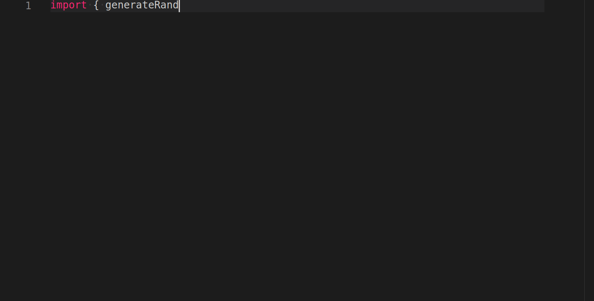

### Typoist
A fun program that can be used to fake fast typing or create typing timelapses.

<p align="center">
  
</p>

### Table of Contents
- [Installation](#installation)
- [Browser Usage](#browser-usage)
- [Examples](#examples)
- [API](#api)
- [LICENSE](LICENSE)

### Installation
Install via node.js or yarn
```shell
npm install typoist
# Or
yarn add typoist
```

### Browser Usage
Get the dist files from the [releases page](https://github.com/HarshKhandeparkar/typoist/releases/) and include them in the html.
```html
<script src="./path/to/typoist.min.js"></script>
```
All the exported members will be available under a global variable `Typoist`, eg: `Typoist.Typoist`. See the [API Docs](#api).

### Examples
1. [Browser Example](https://harshkhandeparkar.github.io/typoist/). See the code in the `gh-pages` branch.
2. [Node.js CLI Example](example/cli-typoist): Clone this repo and use locally.

### API
Typoist exports the following:

1. `Typoist` (class): The main class having the following properties.
  - `constructor(settings)`: Where settings is an object with the following properties:
    ```ts
    {
      /** The maximum typing speed in characters per second. */
      speed?: number, // Default: 10
      /** Probability of making a mistake. */
      mistakeProbability?: number, // Default: 0.1
      /** The maximum number of wrong characters typed during a mistake. */
      mistakeLength?: number, // Default: 3
      /** A function that is fired each time a character is to be appended to the output. */
      appendFunction: (character: string) => void, // No default
      /** A function that is fired each time the last character in the final output is to be removed. */
      deleteFunction: () => void, // No default
      /** A callback that is fired when typing is complete. */
      onComplete?: () => void // No default
    }
    ```

  - `setStringToType(string)`: This method is used to set the typing string. (and to change it later)
  - `startTyping()`: Start typing.
  - `stopTyping()`: Stop typing.

    NOTE: All methods are chainable.

2. `TypoistDefaults`: An object containing all the default settings.

Example:
```js
const { Typoist } = require('typoist');
const inputString = 'Hello World';
const outputString = '';

const typoist = new Typoist({
  speed: 2,
  mistakeProbability: 0.2,
  mistakeLength: 1,
  appendFunction: (character) => outputString = outputString + character, // Add a character to the end
  deleteFunction: () => outputString = outputString.slice(0, -1) // Remove a character from the end
})
```

#### Thank You!
> Open Source by Harsh Khandeparkar
